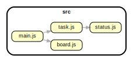

# Boardr - Task organizing system

### 1. Description

In its complete form, _Boardr_ will be a system for creating, updating, organizing, and managing tasks, issues, and notes. The application will be built **using the best practices for object-oriented design** (OOD) and **object-oriented programming** (OOP).

<br>

### 2. Project information

- Language and version: **JavaScript ES2020**
- Platform and version: **Node 14.0+**
- Core Packages: **ESLint**, **JSDoc**

<br>

### 3. Goals

Today, we will lay down the foundations of this system. The **goal** is to design the two main **classes** of the system - the `Board` class and the `Task` class. We will use and improve upon these classes later in the course. In addition, you will have to document the code you wrote using JSDoc. During this session, you will exercise:

- Working with classes - writing classes and creating instances of those classes.
- Modeling classes using `fields` (state) and `methods` (behavior).
- Protecting the state using validations.
- Writing basic code documentation using **JSDoc**.

<br>

### 4. Setup

To get the project up and running, follow these steps:

1. Go inside the `Template` folder.
1. Run `npm install` to restore all dependencies.
1. After that, there are a few scripts you can run:

   - `npm run start` - Runs the `src/main.js` file.
   - `npm run lint` - Lints the code inside the `src` folder using **ESLint**.
   - `npm run docs` - Generates documentation in a `docs` folder using **JSDoc**.

<br>

### 5. Getting started

The first step is to read the **whole task description**. This will give you an overall idea what is going on and what is expected of you. The next step is to get familiar with the **provided code**. There are a few key things you can do:

- Get familiar with the overall project - what config files exist, what are their settings, what folders are there and what files are there in those folders.
- The code is usually stored in a `src` folder. There could be other folders, such as `docs` for documentation, usually generated from a script (like jsdoc).
- You can also check the dependency graph, which will give you an overall idea how different parts of the code are connected, but most importantly, in what order to read the code itself.
  
- Start with the entry point (usually the `main.js` file) and slowly review the code written inside. Then move on to the imported files, read them and move on to their dependencies and etc.
- Some of the provided code will already be documented using the JSDoc syntax. This will give you a good idea what that code does and how you can use it to complete the task.
- You can also find comments, hints or even links to resources you should check out to gain further understanding of a specific part of the code or a new concept that is introduced there.

<br>

### 6. The `Task` class

After you have gotten yourself familiar with the project, it's time to work on your first task. Write a class that will be used to create tasks. The objects created from that class should have the following state:

- `name` - It should never be **null, undefined or an empty string**, its length should be between **6 and 20 characters**
- `dueDate` - The date of the deadline. Think of what validation will be needed here.
- `status` - The task's status should be one of the three `TODO`, `IN_PROGRESS`, or `DONE`. Think of what is the best way to represent the value and its type.

The following methods should be implemented as well:

- `changeName(value)` - It should set the `name` to the passed `value`, only if that `value` is valid!
- `changeDueDate(value)` - It should set the `dueDate` to the passed `value`, only if that `value` is valid!
- `reset()` - It should set the status of the task to `TODO`
- `advance()` - It should set the status of the task to `IN_PROGRESS`
- `complete()` - It should set the status of the task to `DONE`

<br>

#### 6.1 Using the Task class

Now, when you have the `Task` class implemented try to create a few instances of the class inside the `main.js` file:

```javascript
const task1 = new Task("Validate fields", new Date("2022/09/03"));
const task2 = new Task("Write unit tests", new Date("2022/09/04"));
const task3 = new Task("Remove console.log", new Date("2022/09/05"));
```

What happens when you put the tasks in an array and try to print the array?

```javascript
const tasks = [task1, task2, task3];
console.log(`${tasks}`);
```

In some cases the compiler will try to convert the array to string and you might see something like this:

```json
[object Object],[object Object],[object Object]
```

Remember what are the two methods common to every JavaScript object and type (except for `null`, `undefined`, and objects created with `Object.create(null)`)

- `toString()` and `valueOf()`.

The built-in `toString` method of the `Array` class will return a string with the values of the array converted to strings on their own, separated with comma. In order to force the array to be printed this way you can use the method explicitly:

```typescript
console.log(tasks.toString());
```

<br>

#### 6.2 Extending the Task class

Because this format is not very readable, think of a way to **override** the `toString()` method of the task so that it returns a more meaningful string, for example:

```text
Name: Update naming
Status: Todo
Due: 9/4/2022 12:00:00 AM
```

<details>
  <summary>Hint: How to change the behavior of toString()?</summary>

  Create a new method called `toString()` inside the Task class. Whatever you write inside that method will be executed instead of the default `toString()` that comes from JavaScript itself.
</details>

<details>
  <summary>Hint: How to format the date?</summary>
Option 1: Explore native <a href="https://www.freecodecamp.org/news/how-to-format-dates-in-javascript/" target="_blank|">date formatting options</a>   

Option 2: Use an external library. 

You can use `moment.js` to format the date to your liking. Install `moment.js` using `npm install moment`, then import it inside the `task.js` file using `import moment from 'moment';`.
</details>

<br>

### 7. The `Board` class

The `Board` class will hold all the different tasks we create. Its role will be to _contain_ the tasks and expose some functionality to manage them.

You need to implement the different fields and methods of the class:

- `tasks` - This field is an array that holds `Task` objects.

The board should expose the proper methods which allow for tasks to be added or removed from the board. Think of the needed checks and validation:

- `add(task)` - It should add a task to the list of tasks in the board. A single task can be added only once!
- `remove(task)` - It should remove a task from the list of tasks. The board should not allow for a task to be removed if it's not in the list!

<br>

#### 7.1 Implementing  `toString()`

You need to override the `toString` method of the board, just like you did for the Task class. it should return a string that contains useful information about the object, example of such return is as follows:

#### Empty board

```text
---Task Board---

Tasks:

No tasks at the moment.
```

#### Board with some tasks

```text
---Task Board---

Tasks:

Name: Validate fields
Status: InProgress
Due: 9/3/2022 12:00:00 AM
--------
Name: Write unit tests
Status: Done
Due: 9/4/2022 12:00:00 AM
--------
Name: Remove console.log
Status: Todo
Due: 9/5/2022 12:00:00 AM
```

<br>

### 8. Document the code

Document the code using the JSDoc syntax. Write a short description of what each **field** and **method** does. For example:

```javascript
/** Adds a new task to the board, only if it is valid.*/
add(task) {
  ....
}
```

Then proceed to generate the `docs` folder using `npm run docs`.

<br>

### 9. Testing the `Board` and the `Task` classes

You can paste the following sample code inside the `main.js` file. Running this code should produce the output shown below. Even if the outo:

```javascript
// Print a colorful line on the console
const newline = () => console.log("\n \x1b[35m* * * * *\x1b[37m \n");

const board = new Board();
const anotherBoard = new Board();

const task1 = new Task('Validate fields', new Date("2022/09/03'));
const task2 = new Task('Write unit tests', new Date('2022/09/04'));
const task3 = new Task('Remove console.log', new Date('2022/09/05'));

console.log(board.toString());

newline();

board.add(task1);
board.add(task2);
board.add(task3);

task1.advance();
task2.complete();

console.log(board.toString());

newline();

board.remove(task3);

console.log(task1.toString());

newline();

console.log('board.itemCount:', board._tasks.length);
```

Sample output text:

```text
No tasks at the moment.

 * * * * *

---Task Board---

Tasks:

Name: Validate fields
Status: In progress
Due: 9/3/2022 12:00:00 AM
--------
Name: Write unit tests
Status: Done
Due: 9/4/2022 12:00:00 AM
--------
Name: Remove console.log
Status: Todo
Due: 9/5/2022 12:00:00 AM

 * * * * *

Name: Validate fields
Status: In progress
Due: 9/3/2022 12:00:00 AM

 * * * * *

board.itemCount: 2
```

